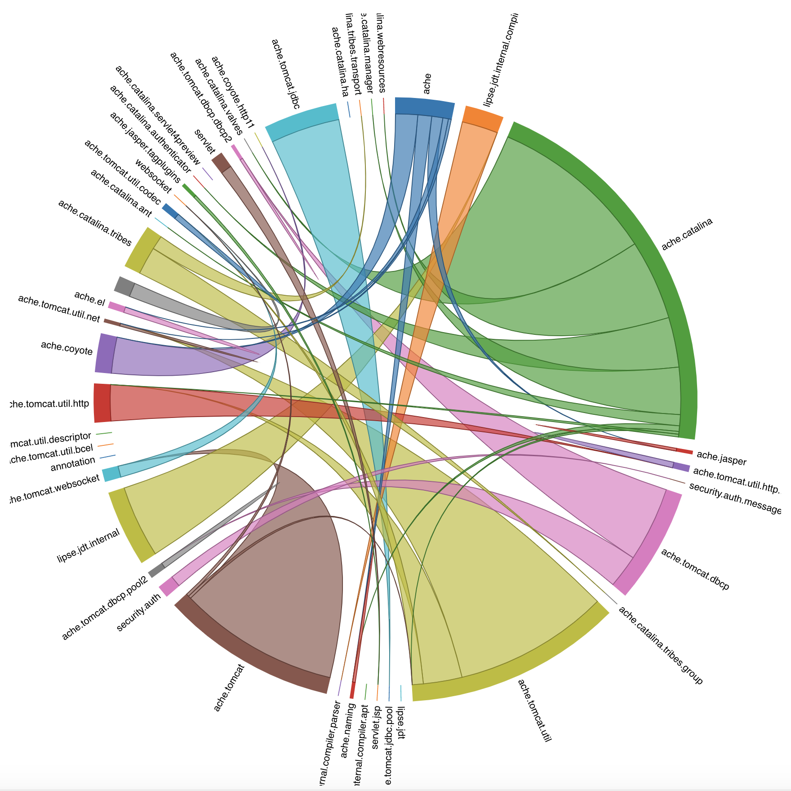

# CSCI 578 Project

## Project Description

The two recovery techniques we discussed in class, ACDC and ARC, are not suitable for recovering security architectural decisions which usually span more than one structural component. The purpose of this project is to implement changes to ACDC to address this issue.

We have chosen Apache Tomcat 8.0.47 for this project.

## Security Decision

### CVE-2017-12617

- [Description](https://cve.mitre.org/cgi-bin/cvename.cgi?name=CVE-2017-12617): When running Apache Tomcat versions 9.0.0.M1 to 9.0.0, 8.5.0 to 8.5.22, 8.0.0.RC1 to 8.0.46 and 7.0.0 to 7.0.81 with HTTP PUTs enabled (e.g. via setting the readonly initialisation parameter of the Default servlet to false) it was possible to upload a JSP file to the server via a specially crafted request. This JSP could then be requested and any code it contained would be executed by the server.
- [Revision](https://svn.apache.org/viewvc?view=revision&revision=1809921): Add some additional checks required on Windows to keep all the checks in one place and to avoid exceptions later in the processing. Includes utility class to determine if platform is Windows and performance test case for alternative implementations.

Even though *AbstractFileResourceSet* is dependent on *JrePlatform*, the two are in different clusters. As shown below:


#### Why ACDC Failed to Recover

When we took a closer look at the implementation of ACDC, we found the reason for this. The SubGraph module in ACDC searches for he dominated nodes of each dominator node. In order for a node to be considered as a dominted node, it must satisfy two requirements, as specified in the code comment:

```text
Returns the HashSet containing the passed arg, called "dominator node", and the set of its 
dominated nodes, N = n(i), i:1,2,...m,  which have the following properties:

1. there exists a path from tentativeRoot to every n(i)
2. for any node v such that there exists a path from v to any n(i), either tentativeRoot 
   is in that path or v is one of n(i)
```

Therefore, when the following situation happens, the components will not be clustered together.


#### How We Solve the Problem

In order to resolve the limitation of SubGraph, we created a new node to include the components that were not clustered previously. If a component is only used by one other component, we create a new node to be the dominator node of the two components. Then the two components wil be clustered together.
We took the idea from the BodyHeader pattern

A list of files we modified:

| File                                      | Reason |
| ----------------------------------------- | ------ |
| [ACDC.java](src/acdc/ACDC.java)           | add a new pattern   |

We Also added a new file:

| File                          | Reason |
| ----------------------------- | ------ |
| [Attach.java](src/acdc/Attach.java) | Design a new pattern to cluster files related to the architecture decision  |

Result cluster:


## Visualization


